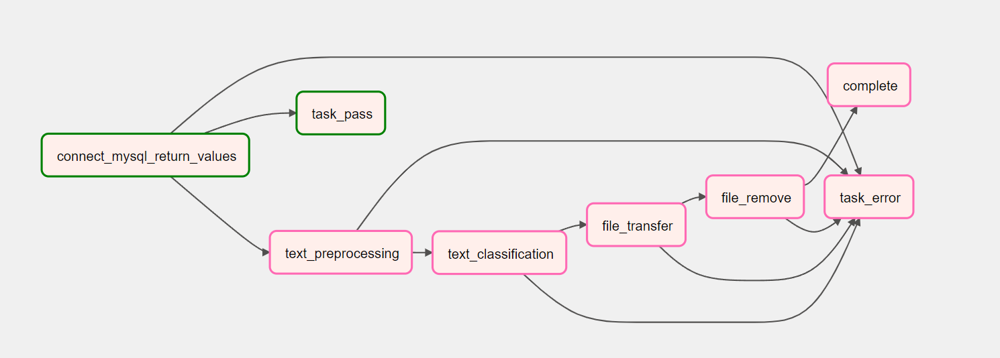

# RealATS? Airflow 스케쥴링

## 프로젝트 개요
이 프로젝트는 RealATS? 기능을 Airflow 스케쥴링을 통해 구현한 것입니다.
<br><br><br>

## 요구사항
- Python : 3.8
- Apache Airflow : 2.5.3
- ats-ckonlpy : 1.0.0
- keras : 2.10.0
- pandas : 1.5.0
- PyMySQL : 1.0.3
- tensorflow : 2.10.0
<br><br><br>

## 설정
- Airflow 설정 파일의 경로: airflow.cfg
- 스케줄러 타입: LocalExecutor
- 실행 주기: */10 * * * * (매일 10분에 한 번씩)(미정)
<br><br><br>

## DAG 파일 구조
- dags/ 디렉토리에 각각의 DAG 파일이 저장됩니다.
- dags/ats_schedule_dag.py: 예제 DAG 파일입니다.
- dags/ats_scheduler_tasks.py: 태스크 정의 파일입니다.
- dags/ats_module: RealATS? 모듈 폴더입니다.
<br><br><br>

## 사용법
```
$ conda activate venv # 가상환경 접속
$ airflow scheduler -D # 스케쥴러 실행
$ airflow webserver -p <port> # 웹서비스 실행
```
스케쥴러와 웹서비스를 띄우고 해당 포트로 접속하시면 됩니다.
<br><br><br>

## Task 설명

<br>

### 1. Task 1: connect_mysql_return_values
- mysql에 접속하여 수행해야할 Task가 있는지 검색합니다.
- 없을 경우 task_pass에 전달하고 있다면 text_preprocessing에 검색한 정보를 전달합니다.
<br>

### 2. Task 2: text_preprocessing
- 적요 데이터 전처리를 수행합니다.
- 도중에 에러가 발생하면 task_error에 전달하고 성공적으로 수행한다면 text_classfication을 수행합니다.
<br>

### 3. Task 3: text_classfication
- 전처리된 데이터를 분류합니다.
- 도중에 에러가 발생하면 task_error에 전달하고 성공적으로 수행한다면 file_transfer를 수행합니다.
<br>

### 4. Task 4: file_transfer
- 분류가 끝난 데이터를 WEB서버에 전송합니다.(sftp)
- 도중에 에러가 발생하면 task_error에 전달하고 성공적으로 수행한다면 file_remove를 수행합니다.
<br>

### 5. Task 5: file_remove
- 파일 전송까지 끝났다면 해당 서버에 있는 파일과 WEB서버에 있는 원본파일을 삭제합니다.
- 도중에 에러가 발생하면 task_error에 전달하고 성공적으로 수행한다면 complete를 수행합니다.
<br>

### 6. Task 6: complete
- 모든 Task가 수행되었음을 알리도록 DB에 접근하여 완료상태인 처리상태코드로 수정합니다.
<br>

### 7. task_pass
- 스케쥴러 실행시 수행해야할 Task가 없으면 수행되는 Task 입니다.
<br>

### 8. task_error
- task 수행중 에러 발생시 수행되는 Task 입니다.
<br>